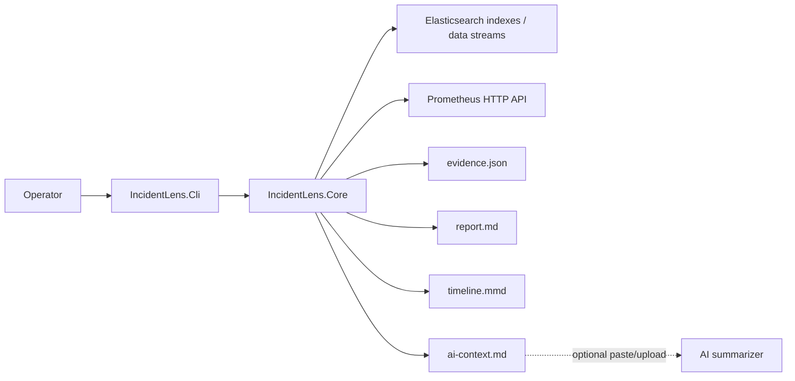
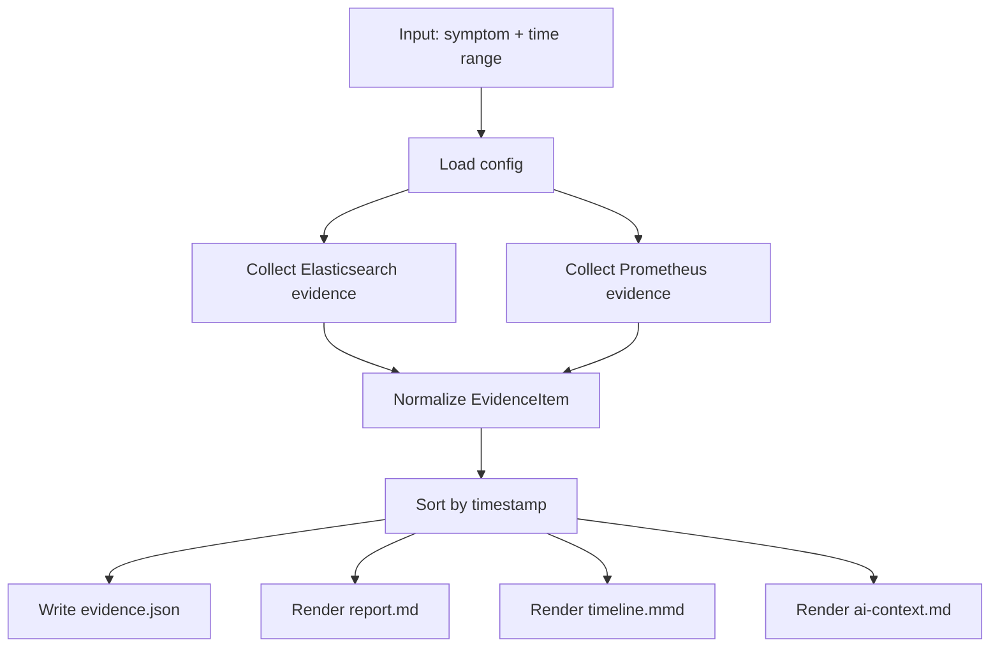

# IncidentLens v0 Design

## Goal

Create a very small tool that answers one question:

> Given a symptom and a time window, what evidence can we quickly collect from Elasticsearch and Prometheus?

The output should be useful even before any AI integration exists.

## Simplified architecture

## Components

### IncidentLens.Cli

Responsible for:

- parsing CLI arguments
- loading JSON config
- creating an `IncidentRequest`
- invoking `IncidentLensRunner`
- writing output files

### IncidentLens.Core

Responsible for:

- evidence model
- Elasticsearch collector
- Prometheus collector
- evidence sorting and simple scoring
- Markdown rendering
- Mermaid rendering
- sanitized AI context rendering

### AI summarizer

Not implemented in v0 as a production connector.

For v0, AI is intentionally external. The collector writes `ai-context.md`, and the user can paste it into ChatGPT, a local LLM, or another approved model.

## Data flow

## Evidence model

`EvidenceItem` is intentionally small:

- `timestamp`
- `source`
- `kind`
- `severity`
- `title`
- `summary`
- `service`
- `environment`
- `host`
- `labels`
- `link`
- `relevanceScore`
- `raw`

## Query model

### Elasticsearch

The v0 collector searches configured indexes/data streams. It applies:

- time range filter
- optional simple text search from `symptom`
- optional service filter
- optional environment filter
- result limit

### Prometheus

The v0 collector runs configured `query_range` expressions.

For each result series, it emits one evidence item if the maximum observed value is greater than or equal to the configured threshold.

## Output contract

### `evidence.json`

Machine-readable normalized evidence.

### `report.md`

Simple deterministic report:

- request summary
- evidence counts
- confirmed observations
- timeline
- missing data / limitations
- recommended next checks

### `timeline.mmd`

Mermaid diagram that can be pasted into Markdown tools that support Mermaid.

### `ai-context.md`

Sanitized evidence packet for AI analysis.

## Design rules

1. No AI has direct production access in v0.
2. No writes to Elasticsearch or Prometheus.
3. No hidden background jobs.
4. No claim without evidence.
5. Empty evidence is a valid result and must be reported clearly.
6. Configuration is explicit; auto-discovery can come later.

## Future extensions

Good next steps after v0 is useful:

- Alertmanager connector
- Kubernetes events connector
- OpenTelemetry traces connector
- Grafana link renderer, not a collector
- query packs per symptom type
- baseline comparison window
- local LLM summarizer command
- GitHub Actions workflow to build releases
